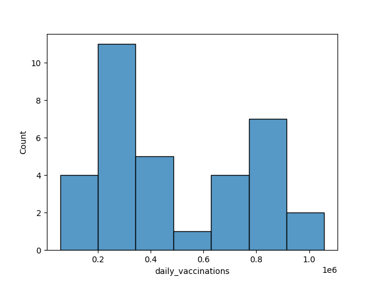
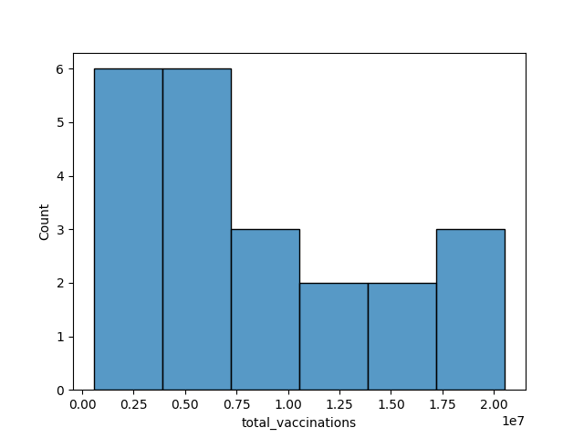
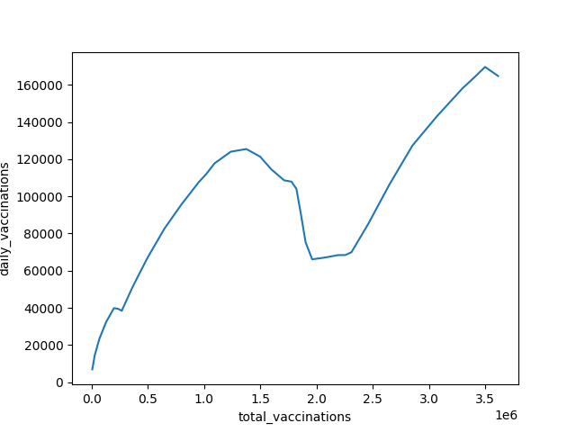
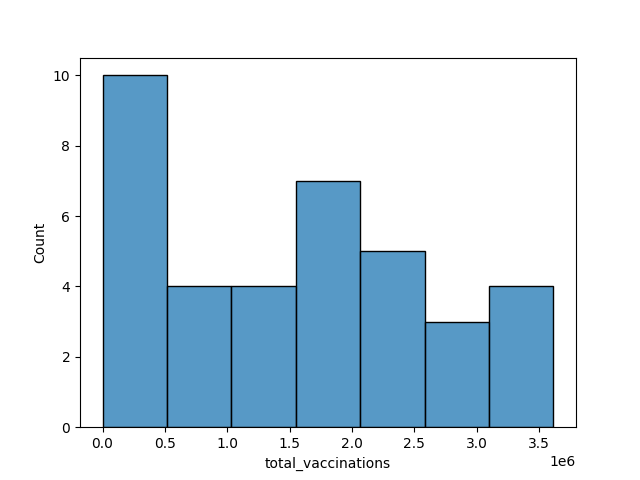
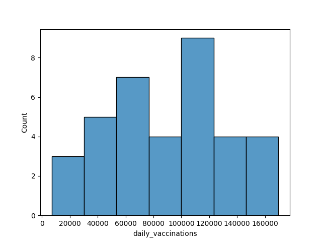

### Dataset:

Vaccines

### Analysis + Conclusions
I looked at the daily vaccinations, and the total vaccinations, of the United States, and compared the relationships between the two variables to Israel's relationships.

The average daily vaccinations in the united States per time period is 4.924266e+05, with a standard deviation of 2.920803e+05. This is a very large standard deviation, which shows that the data varies greatly. The difference between the 50% and the 75% is the greatest difference for the percentiles, which shows that the data is mostly clumped on the lower end, but also has a clump, though not as large, at the upper end. Furthermore, this can be seen in the histogram below. There is one peak in the data, with it being in the second category, and there is a spike in the 6th one.The data is skewed slightly to the right, but nothing too major. 

The average total vaccinations for the United States is 8.274131e+06. This number is larger than the median, which shows that the data is mostly clumped at the smaller end. This can be seen in the histogram below. The data skewed to the right, and has one peak, and two modes. It is at the very low end of the data. The standard deviation is larger than the median, being 6.342529e+06, and the median being, 6.303824e+06. THis is an insane standard deviation, and truly shows how varied the data is. 

The two variables have a very high positive correlation. It is 0.9844682556005346. This can be visibly seen as well in the graph below. It is not a perfectly straight line, but it is pretty close. This was what I was expecting for the United States since the majority of the population has not been vaccinated yet. Once we get closer to the entirety of the population getting vaccinated, the daily vaccinations will most likely decline, while the total vaccinations continue to grow. I expected to see this in Israel, but was wrong. Israel's relationship has a correlation of 0.7783750467452519. It is a medium positive correlation, not as high. The reason why can be seen in the line chart below. At around 1.4X10^6 people being vaccinated, the daily vaccinations declined. However, it eventually rebounded, and at 2.5X10^6 people being vaccinated, it started shooting back up at a high rate. My conclusion for this was that Israel most likely received a shipment of vaccines and was running out, and then when they received more, it increased the daily vaccinations. 

###### USA Graph

###### Israel Graph

I can draw the conclusion that the United States and Israel are not stopping their growth in daily vaccinations yet. I expect this to happen in the future, but the data shows no indication of that happening.  It also shows that Israel and the United States have had no consistency with the amount of vaccines they gave daily. However, they both (mostly) consistently increased their daily vaccination rates. Israel faltered a bit, it may have had to do with priority residents already receiving the vaccine, but eventually recovered their vaccination increase trend. I was expecting Israel to have a steady amount of daily vaccinations for a period of time, but they never had that, showing that these countries are giving vaccines based on the amount they receive and can distribute without setting daily standards. 

### Additional Israel Graphs If You Are Interested

